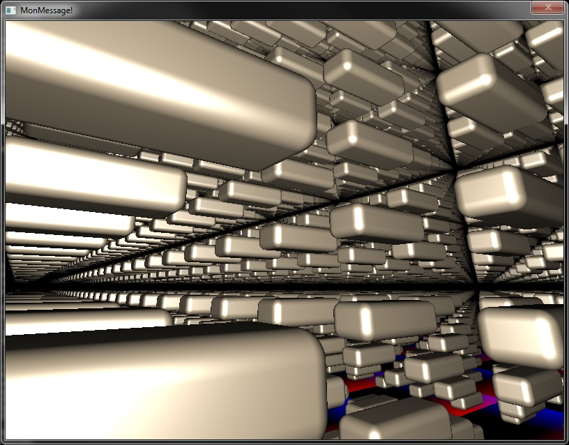

# LibRT

Export your project to desktop : Windows / Linux

This is a Back-end compiler toolchain (base on MinGW & Clang) designed to work with [Cwc](https://github.com/Honera/Cwc)

Use the "-wCompiler Honera/LibRT"command-line to automatically download/use this toolchain (Default)

# Example

## Raymarching with GZE

